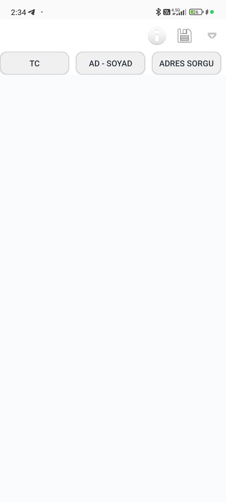
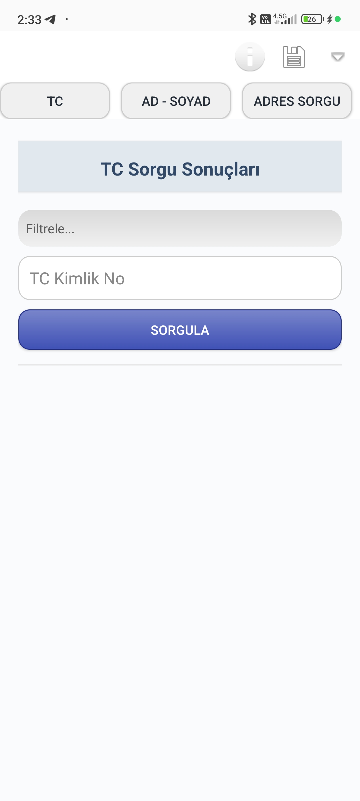
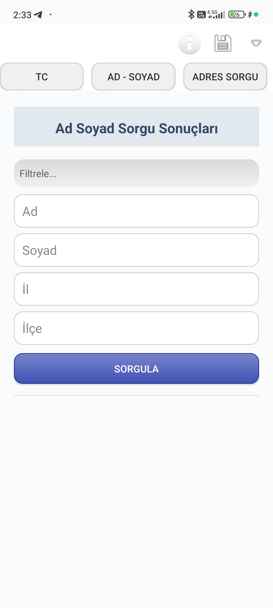

# ONDEX API Sorgulama Uygulaması 🔍

Türkiye'de çeşitli resmi verilere erişim sağlayan API'leri kullanan Android uygulaması.

## 🛠️ Teknoloji ve Özellikler

### 📱 Platform


### 💻 Geliştirme


### 🌐 API Entegrasyonu


### 📦 Proje Bilgileri


### 👥 Topluluk


## 🚀 API Endpointleri

| API No | Açıklama | Parametreler | Endpoint |
|--------|----------|--------------|----------|
| API1 | TC Kimlik Sorgu | `tc` | `https://api.hexnox.pro/sowixapi/tcpro.php?tc={TC}` |
| API2 | Ad-Soyad Sorgu | `ad`, `soyad`, `il`, `ilce` | `https://api.hexnox.pro/sowixapi/adsoyadilce.php?ad={AD}&soyad={SOYAD}&il={IL}&ilce={ILCE}` |
| API3 | Adres Sorgu | `tc` | `https://api.hexnox.pro/sowixapi/adres.php?tc={TC}` |
| API4 | Hane Sorgu | `tc` | `https://api.hexnox.pro/sowixapi/hane.php?tc={TC}` |
| API5 | Okul No Sorgu | `tc` | `https://api.hexnox.pro/sowixapi/okulno.php?tc={TC}` |
| API6 | İşyeri Sorgu | `tc` | `https://api.hexnox.pro/sowixapi/isyeri.php?tc={TC}` |
| API7 | GSM Detay Sorgu | `gsm` | `https://api.hexnox.pro/sowixapi/gsmdetay.php?gsm={GSM}` |
| API8 | Aile Sorgu | `tc` | `https://api.hexnox.pro/sowixapi/aile.php?tc={TC}` |
| API9 | Sülale Sorgu | `tc` | `https://api.hexnox.pro/sowixapi/sulale.php?tc={TC}` |
| API10 | TC/GSM Sorgu | `tc` veya `gsm` | `https://api.hexnox.pro/sowixapi/tcgsm.php?tc={TC}` veya `https://api.hexnox.pro/sowixapi/gsm.php?gsm={GSM}` |
| API11 | Ehliyet Sorgu | `tc` | `http://api.hexnox.pro/sowixapi/ehlt.php?tc={TC}` |
| API12 | Tapu Sorgu | `tc` | `https://api.hexnox.pro/sowixapi/tapu.php?tc={TC}` |
| API13 | Vesika Sorgu | `tc` | `https://hexnox.pro/sowix/vesika.php?tc={TC}` |
| API14 | Adres Detay Sorgu | `tc` | `https://hexnox.pro/sowixfree/premadres.php?tc={TC}` |

## 🔍 API Kategorileri

### 🆔 Kimlik Bilgileri
 

- TC Kimlik No ile temel bilgiler
- TC veya GSM numarası ile çoklu sorgu

### 🏠 Adres Bilgileri


- TC ile adres bilgisi
- Hane bilgileri
- Detaylı adres raporu

### 👨‍👩‍👧‍👦 Aile ve Akrabalık


- Aile bireyleri bilgisi
- Sülale ve soy bilgisi

### 📚 Eğitim Bilgileri

- Okul ve öğrenci bilgileri

### 💼 İş ve Meslek

- İşyeri ve çalışma bilgileri

### 📱 İletişim Bilgileri

- GSM numarası detay sorgusu

### 🚗 Ehliyet ve Belge

- Ehliyet ve sürücü belgesi bilgisi

### 🏡 Emlak Bilgileri

- Tapu ve mülk bilgileri

### 📷 Vesika Bilgileri

- Resmi vesika ve fotoğraf bilgisi

### 🔎 Kişi Arama

- Ad, soyad, il ve ilçe ile kişi arama


## 🛠️ Teknoloji ve Özellikler

### 📱 Platform


### 💻 Geliştirme


### 🌐 API Entegrasyonu


### 📦 Proje Bilgileri


### 👥 Topluluk


## 🚀 Özellikler

<div align="center">


</div>

- **Çoklu API Desteği** - 14 farklı resmi veri sorgulama seçeneği
- **Akıllı Filtreleme** - Sonuçlarda anında arama ve filtreleme
- **Export Özelliği** - TXT, JSON, CSV ve PDF formatlarında kayıt
- **Bildirim Sistemi** - Sorgu sonuçları için anlık push bildirimleri
- **Material UI** - Modern ve kullanıcı dostu arayüz
- **Veri Paylaşımı** - Sonuçları kolayca paylaşma özelliği

## 🌍 Çoklu Dil Desteği 


Uygulama 3 dilde tam destek sunmaktadır:
- 🇹🇷 Türkçe (Varsayılan)
- 🇬🇧 İngilizce 
- 🇩🇪 Almanca

## 📝 Kullanım Kılavuzu

   
   
 

1. Uygulamayı başlatın
2. Menüden istediğiniz sorgu türünü seçin
3. Gerekli bilgileri ilgili alanlara girin
4. "Sorgula" butonuna basarak işlemi başlatın
5. Gelen sonuçları detaylı şekilde inceleyin
6. İsterseniz sonuçları 4 farklı formatta dışa aktarın

## ⚠️ Güvenlik & Gizlilik


- Tüm API bağlantıları SSL şifreleme ile korunmaktadır
- Kişisel veriler cihazda şifrelenerek saklanır
- KVKK ve GDPR uyumludur

## 🖼️ Ekran Görüntüleri

| Ana Sayfa | Sorgu 1 Ekranı | Sorgu 2 Ekranı |
|-----------|--------------|----------|
|  |  |  |


## 👨‍💻 Geliştirici Bilgileri

<div align="center" style="margin: 30px 0;">

[](https://github.com/Memati8383)
[](https://instagram.com/ferit22901)
[](mailto:akdemirferit@gmail.com)

</div>

<p></p>

<p>&nbsp;</p>

<p></p>

## ⚖️ Lisans Bilgisi

<div style="background: #f5f5f5; padding: 20px; border-radius: 10px; border-left: 5px solid #2ecc71; margin: 20px 0;">

```text
MIT License

Copyright (c) 2025 Ferit Akdemir

Bu lisans, bu yazılımın kopyalarını alan herkese ücretsiz olarak,
yazılım ve ilgili belgeler ("Yazılım") üzerinde sınırsız kullanım hakkı verir.
Yazılımın kopyalarını düzenleme, birleştirme, yayımlama, dağıtma,
alt lisanslama ve/veya satma hakkı da dahil olmak üzere,
Yazılımla ilgili tüm haklar saklıdır.
```
</div>
